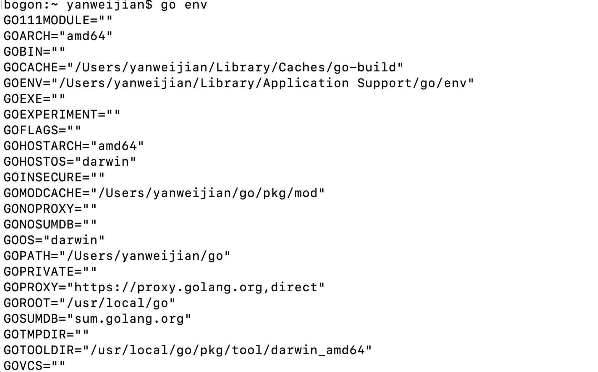
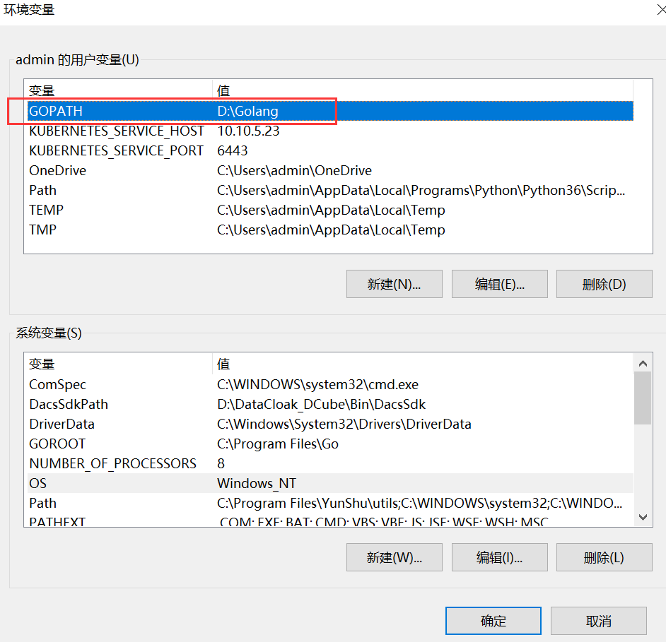
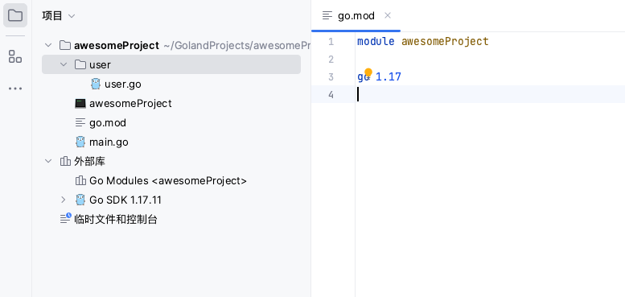
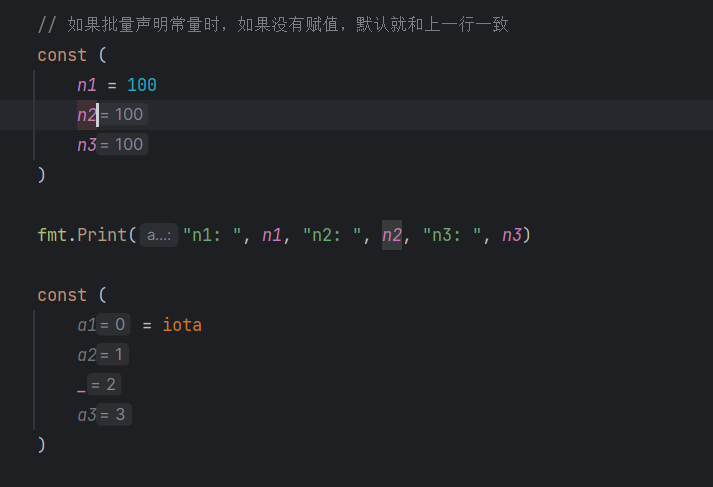
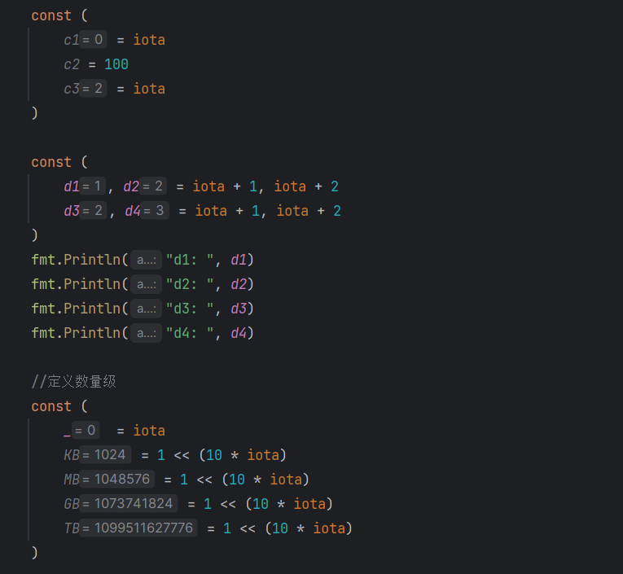

# golang 笔记一

 

# golang开发环境搭建

## 下载 

Golang1.17.13 

* windows [https://go.dev/dl/go1.17.13.windows-amd64.msi](https://go.dev/dl/go1.17.13.windows-amd64.msi)
* MacOS https://go.dev/dl/go1.17.13.darwin-amd64.pkg

## 设置环境变量

golang从1.11开始就已经使用go mod方式管理项目，所以对GOPATH依赖并不是很严重了。所以Mac版本的GOPATH我就没有去进行配置环境变量了。

### Mac版本设置

* 能够执行`go env`命令执行就可以了

    

  

### windows版本设置

* 在进行golang msi安装的时候勾选到安装到系统环境变量中就可以在`cmd`中执行`go`相关命令
* 在系统环境变量中添加`GOPATH`环境变量，并将项目根目录加入到环境变量中即可




### go mod设置（主流管理方式）

* 创建项目目录（通过golang或者是vscode创建即可）
* 在项目根目录执行`go mod init <path>`进行初始化项目即可（golang会自动创建此目录）



# golang运行第一段代码


## 使用golang创建第一个项目

在`golang`创建`awesomeProject`项目，并创建一个`main.go`的文件，main.go内容如下：

```go
package main

import "fmt"

func main(){
	fmt.Printf("Hello Go")
}
```

写完代码后通过idle运行代码即可返回`Hello Go`内容


# golang常用命令

* **go build：编译构建可执行文件**
* **go run：直接运行代码文件**

* go clean：移除对象文件（清除go build生成的可执行文件）

* go env：打印出golang当前环境变量

* go fmt：运行gofmt进行进行格式化

* go get：下载安装包依赖包

  go get [github.com/go-sql-driver/mysql](https://github.com/go-sql-driver/mysql)

* go list：列出包

* go install：编译并安装依赖包

  

# 注意事项

go应用使用的`包`和`模块`来组织代码，包对应到文件系统就是文件夹，模块就是**go**的源文件。一个包中会有多个模块，或者多个子包。

# golang标识符、关键字、命名规则

标识符的英文是<font color="orange">identitfter</font>，通俗的讲，就是给变量、常量、函数、方法、结构体、切片、接口起名字。

## 标识符的组成

1. 标识符由数字、字母下划线组成
2. 只能以字母和下户线开头
3. 标识符区分大小写

## 举例说明标识符的命名

### 正确命名：

```go
package main

import "fmt"

func main() {
    var name string
    var age int
    var _sys string
}
```

### 错误命名：

```go
package main

import "fmt"

func () {
    var 2name string
    var ~age int
    // .....
}
```

### go语言关键字

go语言提供了25个关键字，如下所示：

| break    | default     | func   | interface | select |
| -------- | ----------- | ------ | --------- | ------ |
| case     | defer       | go     | map       | struct |
| clean    | else        | goto   | package   | swith  |
| const    | fillthrough | if     | range     | type   |
| continue | for         | import | return    | var    |


# go语言命名规范

**Go是一门区分大小写的语言**

## 包名称

保持<font color="oriange">package</font>的名字和目录保持一致，尽量采取有意义的包名。包名应该为<font color="red">小写</font>单词，不小使用下划线或者混合大小写。

```go
package main
package service
```

## 错误处理

```go
// 错误写法
if err != nil {
    // 错误处理
} else {
    // 正确处理
}

// 正确写法

if err != nil {
    // 错误处理
    return 
}
// 正常代码
```


# golang变量

变量通俗理解成将一个`值`保存成一个可识别的标识符

## 声明变量

<font color="red">Go语言中变量需要声明后才能使用</font>，同一个作用域中不支持重复声明，并且Go语言的变量声明后必须要使用（这点和Python不太一样）

Go语言中`=`号只有在变量的初始化中会被使用到

**变量声明的语法**

```go
var bianliang type
```

**例如**：

```go
package main

import "fmt"

func main() {
    var name string
    var age int
    
    // 引用变量
    name = "Leon"
    age = 18
}
```


**变量初始化的语法**

```go
var bianliang <type> = <>
```

* <font color="orange"> `var` </font>: 声明变量的关键字
* <font color="orange">`bianliang`</font>: 变量的成
* <font color="orange">`type`</font>: 变量类型

**例如**：

```go
package main

import "fmt"

func main() {
    var name string = "Leon"
    var age int = 18
    var ok bool = true 
    
    // 也可以这样赋值(批量声明)
    var (
    	name string = "Leon"
        age int = 18
        ok bool = true
    )
}


```


**类型推断**：

```go
package main 

func main() {
    // 根据后面的值，就知道是什么类型
    var name = "Leon"
    var age = 18
}
```


**批量初始化**：

```go
package main

func main() {
    var name, age = "Leon", 18 //这里是和python一样的
}
```


**短变量声明**：

在`函数内部`，可以使用`:=`运算符对变量进行声明和初始化

```go
package main

func main() {
    // 这些既不用写类型，也不用写var
    name := "Leon"
    age := 18
    ok := true
}
```


**匿名变量**

如果我们收到了多个变量，有一些变量使用不到，可以使用下划线，表示变量名称，这种变量叫匿名变量。例如

```go
package main

import "fmt"

func getNameandAge()(string, int) {
    return "Leon", 18
}

func main() {
    name, _ := getNameandAge()
}
```


## 常量

相对于变量，常量是恒定不变的值，多用于定义程序运行期间不会改变的那些值。常量的声明和变量非常类似。只是将`var`改成了`const`，常量是在定义的是否赋值。

```
package main

import "fmt"

func main() {
	const name string = "Leon"
	const age int = 18
	const PI float32 = 3.14
	fmt.Println("name", name)
	fmt.Println("age", age)
	fmt.Println("PI", PI)

	// 批量声明常量
	const (
		STATUSOK = 200
		NOTFOUND = 404
	)
	fmt.Println("status:", STATUSOK)
	fmt.Println("notfound:", NOTFOUND)
}
```

### iota

`iota`是go语言的计数器，只能在常量的表达式中使用。`iota`在`const`关键字出现时将被重置为`0`。`const`中每新增一行常量声明将使`iota`计数一次

```
package main

import "fmt"

func main() {
	// 如果批量声明常量时，如果没有赋值，默认就和上一行一致
	const (
		n1 = 100
		n2
		n3
	)

	fmt.Print("n1: ", n1, "n2: ", n2, "n3: ", n3)

	const (
		a1 = iota
		a2
		_
		a3
	)

	const (
		c1 = iota
		c2 = 100
		c3 = iota
	)

	const (
		d1, d2 = iota + 1, iota + 2
		d3, d4 = iota + 1, iota + 2
	)
	fmt.Println("d1: ", d1)
	fmt.Println("d2: ", d2)
	fmt.Println("d3: ", d3)
	fmt.Println("d4: ", d4)

	//定义数量级
	const (
		_  = iota
		KB = 1 << (10 * iota)
		MB = 1 << (10 * iota)
		GB = 1 << (10 * iota)
		TB = 1 << (10 * iota)
	)

}
```

**结果**：




