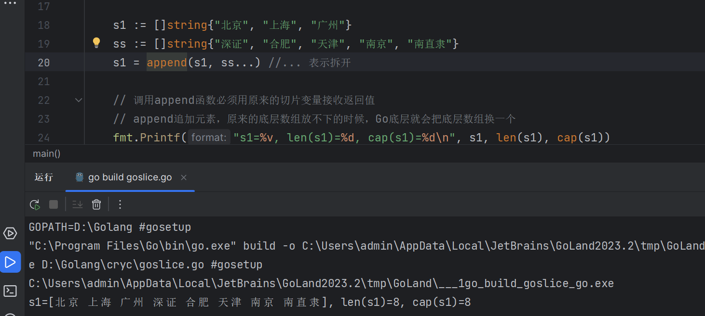
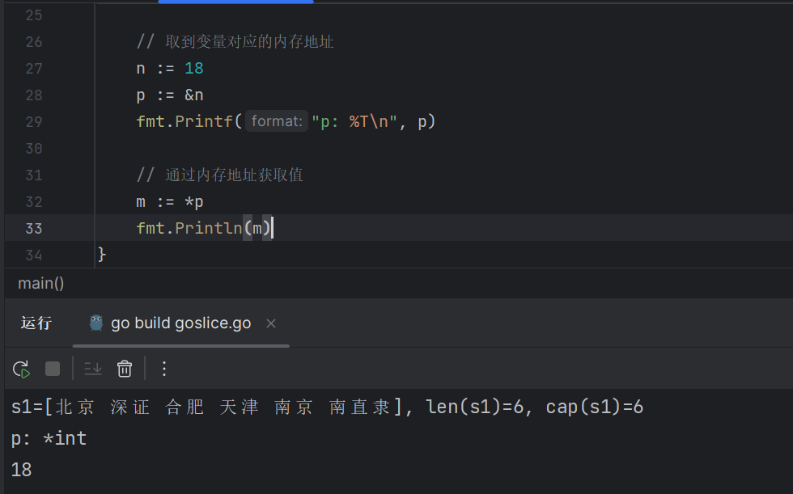

# 1. 数组Array

1. 数组是存放元素的容器
2. 必须制定存放的元素类型和容量（长度）
3. 数组的长度是数组类型的一部分

```go
package main

func main() {
    // 声明一个数组a1，长度为3，数组的类型是布尔类型
    var a1 [3]bool
    
    var a2 [4]bool
}
```

## 1.1 数组的定义

```go
var 数组的变量名 [元素的容量]T  // T是数组中数据的类型
```

## 1.2 数组的初始化

```go
package main 

import "fmt"

func main () {
    // 如果不初始化，bool值默认是false
    var a1 [2]bool 
    
    // 初始化方式一
    a1 = [3]bool{true, false, false}
    fmt.Printf("a1: %v\n",a1)
    
    // 初始化方式二
    // [...]根据初始化值自动推断数组长度
    a100 := [...]int{0, 1, 3, 4, 5}
    
    // 初始化方式三
    // 根据索引值初始化[1 0 0 0 2]
    a3 := [5]int{0:1, 4:2}
}
```


## 1.3 数组的遍历

```go

func main(){
    // for i in 
    citys := [...]string{"北京", "上海", "广州", "深圳"}
    
    for i:=0; i <len(citys); i++ {
        fmt.Println(citys[i])
    }
    
    // for range
    for i,v := range citys {
        fmt.Println(i,v)
    }
}
```


## 1.4 多维数组

```go

func main () {
    var a11 [3][2]int
    // [[1,2] [3,4] [5,6]]
    a11 := [3]int{
        [2]int{1,2},
        [2]int{3,4},
        [2]int{5,6}
    }
    
    // for range
    for i,v := range a11{
        fmt.Println{i,v}
    }
    
    // 数组是值类型
    b1 := [3]int{1,2,3}
    b2 := b1
    b2[0] = 100
    // b1: [1 2 3], b2[100 2 3]
}
```


# 2. 切片slice

因为数组的长度是固定的，并且数组的长度是类型的一部分，所以数组有很多局限性。

切片（slice）是一个拥有<font color="red">相同元素</font>的可变长度的序列。它是基于数组类型做的一层封装。它非常灵活，支持自动扩容。

切片是一个引用类型，他的内部结构包含`地址`、`长度`和`容量`。切片一般用于快速的操作一块数据集合。

## 2.1 切片的定义

```go
var name []T 
```

其中

* name表示变量名称
* T表示切片中的元素类型


## 2.2 切片的初始化

```go
var s1 []int
var s2 []string

s1 = []int{1, 2, 3}
s2 = []string{"北京" , "上海"， "广州"}
```


## 2.3 切片长度和容量

```go

a1 := [...]int{1,2,3,4,5,6,7}
s1 := a1[0:3]

// 切片的容量是底层数组从切片的第一个元素到最后一个元素的数量
fmt.Printf("len(a1):%d cap(a1):%d\n",len(a1),len(a1))
```


## 2.4 make函数创建切片

```go
m1 = make([]int,5, 10)
```

make函数定义切片有三个参数组成，第一个参数是指定切片的类型；第二个参数是定义切片的长短；第三个参数是定义切片的容量。


## 2.5 切片新增(append)元素

```go
s1 := []string{"北京", "上海", "广州"}
ss := []string{"深证", "合肥", "天津", "南京", "南直隶"}
s1 = append(s1, ss...) //... 表示拆开

// 调用append函数必须用原来的切片变量接收返回值
// append追加元素，原来的底层数组放不下的时候，Go底层就会把底层数组换一个
fmt.Printf("s1=%v, len(s1)=%d, cap(s1)=%d\n", s1, len(s1), cap(s1))
```




# 3. 指针

## 3.1 new

Go语言不存在指针操作，只需要记住两个符号：

1. `&`: 取地址
2. `*`: 根据地址取值

```go
// 取到变量对应的内存地址
n := 18
p := &n
fmt.Printf("p: %T\n", p)

// 通过内存地址获取值
m := *p
fmt.Println(m)
```




## 3.2 make

1. make使用来给引用类型的数据分配内存空间的
2. make可以分配的类型包括，array，slice，map
3. 它返回的类型就是这三个类型本身，而不是他们的指针类型


## 3.3 new和make的区别

1. make和new都是用来申请内存的
2. new很少用，一般用来给值类型申请内存（string、int，stuck），返回的是指针
3. make是用来给（slice、map、channel）申请内存的，返回的是这三个类型本身


# 4. map

Go语言的map就相当于Python的字典，存放无序的key/value

## 4.1 map的定义

Go语言中的map定义如下

```go
map["KeyType"]ValueType

// 其中
// KeyType: 表示键的类型
// ValueTYPE: 表示值的类型
//map 类型的变量默认初始值是nil，需要make()函数来分配内存。

make(map[KeyType]ValueType, [cap])
```


## 4.2 map初始化

```go
func main () {
    m1 := make(map[string]string, 5)
    
    m1["China"] = "Beijing"
    m1["USA"] = "huashengdun"
    
    fmt.Println(m1)
    fmt.Println(m1["China"])
    
    // map也支持在声明的时候填充元素，例如：
    userInfo := map[string]string {
        "username": "xiaoyan", 
        "password": "123456", // 最后一个元素需要有逗号
    }
    fmt.Println(userInfo)
}
```


## 4.3 判断某个值是否存在

```go
func main () {
    myMap := make(map[string]string, 5)
    myMap["China"] = "beijing"
    myMap["USA"] = "hsd"
    
    // 如果key存在ok为true,v为对应的值；不存在ok为false,v为值类型的零值
    v,ok := myMap["Chin"]
    
    if ok {
        fmt.Println(v)
    } else {
        fmt.Println("没有这个国家")
    }
}
```


## 4.4 遍历map

```go
otherMap := make(map[string]string, 5)
otherMap["name"] = "xiaoyan"
otherMap["age"] = "18"
otherMap["bbb"] = "ccc"

// 如果不加v就是循环key
for k,v := range otherMap {
    fmt.Printf("key: %v\n", k)
    fmt.Printf("value: %v\n", v)
}
```


## 4.5 指定顺序遍历map

```go
 func main() {
    rand.Seed(time.Now().UnixNano()) //初始化随机数种子

    var scoreMap = make(map[string]int, 200)

    for i := 0; i < 100; i++ {
        key := fmt.Sprintf("stu%02d", i) //生成stu开头的字符串
        value := rand.Intn(100)          //生成0~99的随机整数
        scoreMap[key] = value
    }
    //取出map中的所有key存入切片keys
    var keys = make([]string, 0, 200)
    for key := range scoreMap {
        keys = append(keys, key)
    }
    //对切片进行排序
    sort.Strings(keys)
    //按照排序后的key遍历map
    for _, key := range keys {
        fmt.Println(key, scoreMap[key])
    }
}
```


## 4.6 元素为map的切片

```go
mapSlice := make([]map[string]string, 3)
for index, value := range mapSlice {
    fmt.Printf("index: %v value: %v\n", index, value)
}
mapSlice[0] = make(map[string]string, 5)
mapSlice[0]["name"] = "xiaoyan"
mapSlice[0]["password"] = "xiaoyan"
mapSlice[0]["address"] = "10.10.6.10"
mapSlice[1] = map[string]string{
    "name":     "xiaoma",
    "password": "xiaoma",
    "address":  "10.10.6.21",
}

for key := range mapSlice {

    if key == 0 {
        fmt.Println(mapSlice[key])
    }
}
```


## 4.7 值为切片的map

```go
func main() {
    var sliceMap = make(map[string][]string, 3)
    fmt.Println(sliceMap)
    fmt.Println("after init")
    key := "中国"
    value, ok := sliceMap[key]
    if !ok {
        value = make([]string, 0, 2)
    }
    value = append(value, "北京", "上海")
    sliceMap[key] = value
    fmt.Println(sliceMap)
}
```
