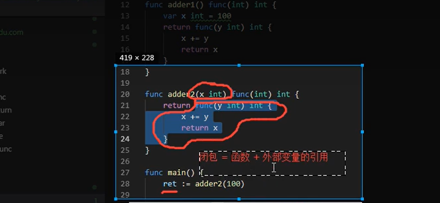
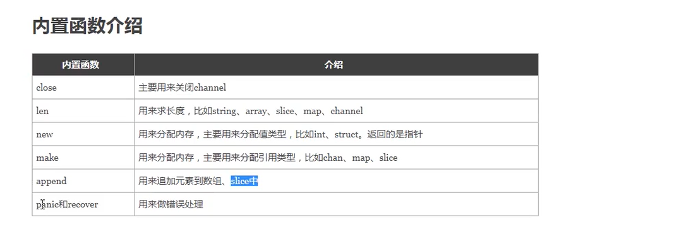

# 1 函数

## 1.1 go函数特点

```
• 无需声明原型。
• 支持不定 变参。
• 支持多返回值。
• 支持命名返回参数。 
• 支持匿名函数和闭包。
• 函数也是一种类型，一个函数可以赋值给变量。

• 不支持 嵌套 (nested) 一个包不能有两个名字一样的函数。
• 不支持 重载 (overload) 
• 不支持 默认参数 (default parameter)。
```

## 1.2 go函数定义

函数的定义

Go语言定义函数使用func关键字，具体类容如下：

```go
/*
函数声明包含一个函数名，参数列表， 返回值列表和函数体。如果函数没有返回值，则返回列表可以省略。函数从第一条语句开始执行，直到执行return语句或者执行函数的最后一条语句。
函数可以没有参数或接受多个参数。
注意类型在变量名之后 。
当两个或多个连续的函数命名参数是同一类型，则除了最后一个类型之外，其他都可以省略。
函数可以返回任意数量的返回值。
*/

func 函数名(参数1 类型1, 参数2 类型2) (返回值){
    函数体
}
```


## 1.3 函数参数

函数定义时指出，函数定义时有参数，该变量可称为函数的形参。形参就像定义在函数体内的局部变量。

但当调用函数，传递过来的变量就是函数的实参，函数可以通过两种方式来传递参数：

```go
// 值传递：指在调用函数时将实际参数复制一份传递到函数中，这样在函数中如果对参数进行修改，将不会影响到实际参数。
// 带参数和返回值的函数
func f1(x int, y int) int {
    sum := x + y
    return sum
}

// 参数类型简写，比如现在有两个参数：x,y它们都是int
func f2(x, y int) int {
    sum := x + y 
    return sum
}

// 可变参数
func f3(title string, y int ...){
    fmt.Println(y)
    return 1
}

// 命名返回值
func f4(x,y int)(sum int){
    sum = x + y //如果使用命名的返回值，那么在函数中可以使用返回值的变量
    return  // return 后面可以省略返回值变量
}

// Go支持多个返回值
func f5(x,y int) (sum, sub int){
    sum = x + y
    sub = x - y
    return  
}

//引用传递：是指在调用函数时将实际参数的地址传递到函数中，那么在函数中对参数所进行的修改，将影响到实际参数。
package main

import (
    "fmt"
)

/* 定义相互交换值的函数 */
func swap(x, y *int) {
    var temp int

    temp = *x /* 保存 x 的值 */
    *x = *y   /* 将 y 值赋给 x */
    *y = temp /* 将 temp 值赋给 y*/

}

func main() {
    var a, b int = 1, 2
    /*
        调用 swap() 函数
        &a 指向 a 指针，a 变量的地址
        &b 指向 b 指针，b 变量的地址
    */
    swap(&a, &b)

    fmt.Println(a, b)
}

// 不定参数传值 就是函数的参数不是固定的，后面的类型是固定的。（可变参数）
// Golang 可变参数本质上就是 slice。只能有一个，且必须是最后一个。
//在参数赋值时可以不用用一个一个的赋值，可以直接传递一个数组或者切片，特别注意的是在参数后加上“…”即可。

func myfunc(args ...int) {    //0个或多个参数
}

func add(a int, args…int) int {    //1个或多个参数
}

func add(a int, b int, args…int) int {    //2个或多个参数
}
```


## 1.4 函数返回值

`"_"`标识符，用来忽略函数的某个返回值

Go 的返回值可以被命名，并且就像在函数体开头声明的变量那样使用。

返回值的名称应当具有一定的意义，可以作为文档使用。

没有参数的 return 语句返回各个返回变量的当前值。这种用法被称作“裸”返回。

直接返回语句仅应当用在像下面这样的短函数中。在长的函数中它们会影响代码的可读性。

```go
package main

import (
    "fmt"
)

func add(a, b int) (c int) {
    c = a + b
    return
}

func calc(a, b int) (sum int, avg int) {
    sum = a + b
    avg = (a + b) / 2

    return
}

func main() {
    var a, b int = 1, 2
    c := add(a, b)
    sum, avg := calc(a, b)
    fmt.Println(a, b, c, sum, avg)
}
```

输出结果：

```
    1 2 3 3 1
```

Golang返回值不能用容器对象接收多返回值。只能用多个变量，或 `"_"` 忽略。

```go
package main

func test() (int, int) {
    return 1, 2
}

func main() {
    // s := make([]int, 2)
    // s = test()   // Error: multiple-value test() in single-value context

    x, _ := test()
    println(x)
}
```

输出结果：

```
    1
```

## 1.5 闭包函数

Go语言是支持闭包的，这里只是简单地讲一下在Go语言中闭包是如何实现的。 下面我来将之前的JavaScript的闭包例子用Go来实现。

```go
package main

import (
    "fmt"
)

func a() func() int {
    i := 0
    b := func() int {
        i++
        fmt.Println(i)
        return i
    }
    return b
}

func main() {
    c := a()
    c()
    c()
    c()

    a() //不会输出i
}
```

闭包复制的是原对象指针，这就很容易解释延迟引用现象。

```go
package main

import "fmt"

func test() func() {
    x := 100
    fmt.Printf("x (%p) = %d\n", &x, x)

    return func() {
        fmt.Printf("x (%p) = %d\n", &x, x)
    }
}

func main() {
    f := test()
    f()
}
```

输出:

```
    x (0xc42007c008) = 100
    x (0xc42007c008) = 100
```




## 1.6 递归函数

* 递归就是函数自己调用自己
* 适合处理那种问题相同，问题的规模越来越小的场景
* 递归一定要有一个明确的退出条件


##  1.7 defer

`defer`多用于函数结束之前释放资源（文件句柄、数据库连接、socket连接断开等）

```go
package main

import "fmt"

func deferdemo() {
    // 一个函数中可以有多个defer语句
    // 多个defer语言按照先进后出原则
	fmt.Println("hhhh")
	defer fmt.Println("cccc")
	defer fmt.Println("dddd")
	defer fmt.Println("eeee")
	fmt.Println("aaaa")
}

func main() {
	deferdemo()
}

```

## 1.8 内置函数




# 2 结构体

`Go`语言中的基础类型可以表示一些事物的基本属性，但是当我们想表达一个事物的全部或者部分属性时，这个时候在用单一一个基本数据类型明显就无法满足需求了，`Go`语言提供了一种自定义数据类型，可以封装多个基本数据类型，这种数据类型叫结构体，英文名称`struct`。也就是我们可以通过`struct`来自定义数据类型了

Go语言中通过`struct`来实现面向对象。

## 2.1结构体的定义

使用`type`和`struct`关键字来定义结构体，具体代码格式如下：

```go
type 类型名 struct {
    字段名 字段类型
    字段名 字段类型
}
```

其中：

* 类型名：表示自定义结构体的名称，在同一个包内不能重复。
* 字段名：表示结构体字段名。结构体中字段名必须唯一。
* 字段类型：表示结构体字段具体类型。


## 2.2 匿名结构体

```go
package main 

import fmt 

main(){
    var s struct {
        x string 
        y string
    }
    
    s.x = "abc"
    s.y = "def"
    
    fmt.Printf("type:%T value:%v\n",s,s)
}
```


## 2.3 结构体和指针

结构体是指类型，赋值就是拷贝


## 2.4 结构体初始化


## 2.5 构造函数

返回一个结构体变量的函数

```go
package main

import (
	"fmt"
)

type person struct {
	name string
	age  int
}

// 构造函数，约定成俗构造函数用new开头
// 返回的是结构体还是结构体指针
// 当结构体里面的字段比较少的时候，可以直接返回结构体，当字段多的时候返回指针。因为结构体是值类型，在做赋值操作的时候就是讲内存复制粘贴
func newPerson(name string, age int) *person {
	return &person{
		name: name,
		age:  age,
	}
}

func main() {
	p1 := newPerson("yanweijian", 20)
	//p2 := newPerson("mayaru", 20)
	fmt.Printf("%v", p1.name)
}

```


## 方法和接受者

定义格式：

```go

```


