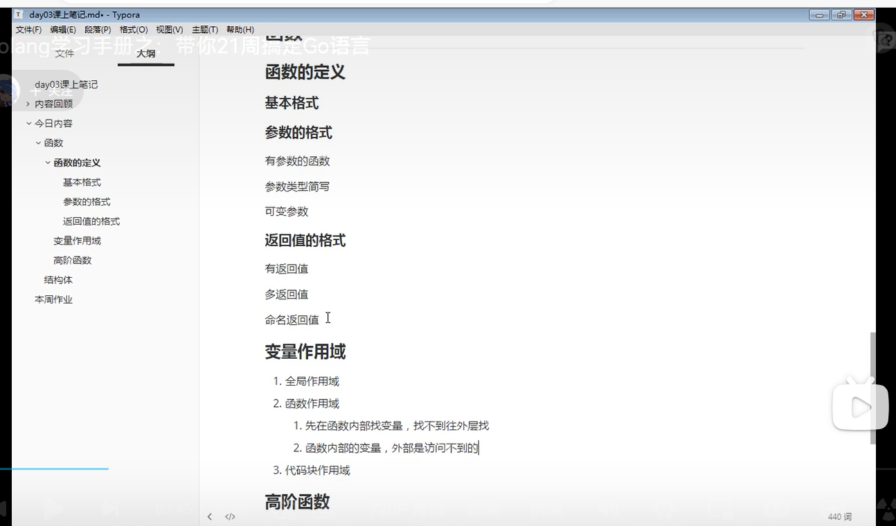

# 1 函数

## 1.1 go函数特点

```
• 无需声明原型。
• 支持不定 变参。
• 支持多返回值。
• 支持命名返回参数。 
• 支持匿名函数和闭包。
• 函数也是一种类型，一个函数可以赋值给变量。

• 不支持 嵌套 (nested) 一个包不能有两个名字一样的函数。
• 不支持 重载 (overload) 
• 不支持 默认参数 (default parameter)。
```

## 1.2 go函数定义

函数的定义

Go语言定义函数使用func关键字，具体类容如下：

```go
func 函数名(参数1 类型1, 参数2 类型2) (返回值){
    函数体
}
```


```go
// 带参数和返回值的函数
func f1(x int, y int) int {
    sum := x + y
    return sum
}

// 参数类型简写，比如现在有两个参数：x,y它们都是int
func f2(x, y int) int {
    sum := x + y 
    return sum
}

// 可变参数
func f3(title string, y int ...){
    fmt.Println(y)
    return 1
}

// 命名返回值
func f4(x,y int)(sum int){
    sum = x + y //如果使用命名的返回值，那么在函数中可以使用返回值的变量
    return  // return 后面可以省略返回值变量
}

// Go支持多个返回值
func f5(x,y int) (sum, sub int){
    sum = x + y
    sub = x - y
    return  
}
```


## 1.3 defer

`defer`多用于函数结束之前释放资源（文件句柄、数据库连接、socket连接断开等）

```go
package main

import "fmt"

func deferdemo() {
    // 一个函数中可以有多个defer语句
    // 多个defer语言按照先进后出原则
	fmt.Println("hhhh")
	defer fmt.Println("cccc")
	defer fmt.Println("dddd")
	defer fmt.Println("eeee")
	fmt.Println("aaaa")
}

func main() {
	deferdemo()
}

```



