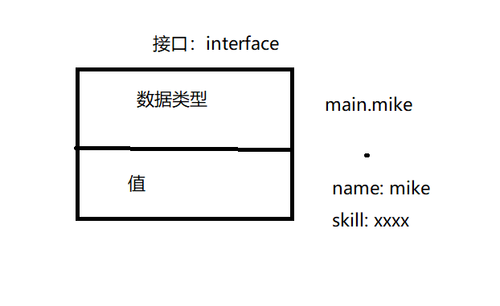

# 1. 接口

接口`interface`是一种类型，它规定了变量有哪些方法

在编程中会遇到以下场景：

不关心一个变量是什么类型，只关心能调用它的什么方法

```go
/*
比如玩过GTA5的时候三个主角都有属于自己的技能，在使用某个按键后都能进入专属的能力（可以把技能理解成方法）。富兰克林使用技能的时候可以上车辆好控制；崔佛在使用技能的时候可以开启杀戮模式。
我们不需要关心每个角色的技能是什么。反正调用技能的方式都是一样的，前提是这个角色是有技能的即可。
*/
```


## 1.1 接口的定义

```
type 接口名 interface {
	方法名1(参数1,参数2) (返回值1,返回值2)
	方法名2(参数1,参数2) (返回值1,返回值2)
	...
}
```

实例

```go
package main

import (
	"fmt"
)

type franklin struct {
	name  string
	skill string
}

type mike struct {
	name  string
	skill string
}

type trev struct {
	name  string
	skill string
}

type specialtimeer interface {
	specialtime()
}

func (f *franklin) specialtime() {
	fmt.Printf("%v使用%v技能架势车辆疯狂加速\n", f.name, f.skill)
}

func (f *mike) specialtime() {
	fmt.Printf("%v使用%v技能时间流逝速度变慢\n", f.name, f.skill)
}

func (f *trev) specialtime() {
	fmt.Printf("%v使用%v技能疯狂杀戮\n", f.name, f.skill)
}

func shiftj(s specialtimeer) {
	s.specialtime()
}

func main() {
	f1 := &franklin{
		name:  "franklin",
		skill: "fk1",
	}

	m1 := &mike{
		name:  "mike",
		skill: "mk1",
	}

	t1 := &trev{
		name:  "trev",
		skill: "t1",
	}
	shiftj(f1)
	shiftj(m1)
	shiftj(t1)
}

```

用来给参数\参数\返回值等设置类型

## 1.2 接口的实现

```go
// 一个变量如果实现了接口中规定的所有的方法，那么这个变量就实现了这个接口，可以理解为这个接口类型的变量

```



## 1.3值接受和指针接受的区别

使用值接收者实现接口和使用指针接收者实现接口的区别：

* 使用值接收者实现接口，结构体类型和结构体指针类型的变量都能存
* 指针接收者实现接口只能存结构体的指针


## 1.4接口和类型的关系

多个类型可以实现同一个接口。

一个类型可以实现多个接口。


## 1.5空接口

空接口没有必须要起名字，通常定义成下面的格式：

```go
interface {} //空接口
```

所有的类型都实现了空接口，也就是任意类型的变量都能保存到空接口中

```go
// 类型断言
package main

import "fmt"

func assign(a interface{}) {
	fmt.Printf("%T\n", a)
	switch t := a.(type) {
	case string:
		fmt.Println("this is string:", t)
	case int:
		fmt.Println("this is int:", t)
	case bool:
		fmt.Println("this is bool:", t)
	}
}

func main() {
	assign("yanweijian")
}
```


# 2. 包（package）


# 3. 文件操作

