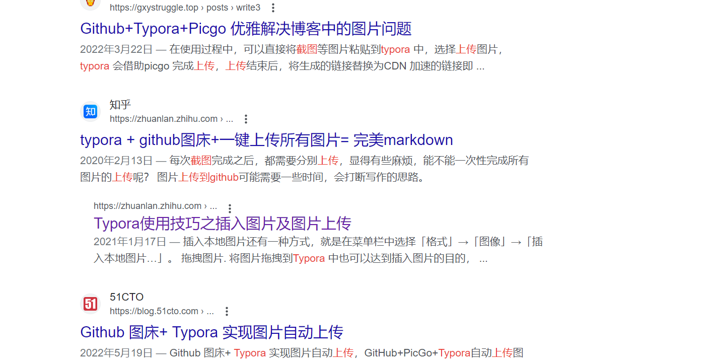

# golang 笔记一

 

# golang开发环境搭建

## 下载 

Golang1.17.13 

	* windows [https://go.dev/dl/go1.17.13.windows-amd64.msi](https://go.dev/dl/go1.17.13.windows-amd64.msi)
	* MacOs [https://go.dev/dl/go1.17.13.darwin-amd64.pkg](https://go.dev/dl/go1.17.13.darwin-amd64.pkg)


## 设置环境变量

golang从1.11开始就已经使用go mod方式管理项目，所以对GOPATH依赖并不是很严重了。所以Mac版本的GOPATH我就没有去进行配置环境变量了。

### Mac版本设置

* 能够执行`go env`命令执行就可以了

    

  

### windows版本设置

* 在进行golang msi安装的时候勾选到安装到系统环境变量中就可以在`cmd`中执行`go`相关命令
* 在系统环境变量中添加`GOPATH`环境变量，并将项目根目录加入到环境变量中即可


### go mod设置（主流管理方式）

* 创建项目目录（通过golang或者是vscode创建即可）
* 在项目根目录执行`go mod init <path>`进行初始化项目即可（golang会自动创建此目录）


# golang运行第一段代码


## 使用golang创建第一个项目

在`golang`创建`awesomeProject`项目，并创建一个`main.go`的文件，main.go内容如下：

```go
package main

import "fmt"

func main(){
	fmt.Printf("Hello Go")
}
```

写完代码后通过idle运行代码即可返回`Hello Go`内容


# golang常用命令

* **go build：编译构建可执行文件**
* **go run：直接运行代码文件**

* go clean：移除对象文件（清除go build生成的可执行文件）

* go env：打印出golang当前环境变量

* go fmt：运行gofmt进行进行格式化

* go get：下载安装包依赖包

  go get [github.com/go-sql-driver/mysql](https://github.com/go-sql-driver/mysql)

* go list：列出包

* go install：编译并安装依赖包

  

# 注意事项

go应用使用的`包`和`模块`来组织代码，包对应到文件系统就是文件夹，模块就是**go**的源文件。一个包中会有多个模块，或者多个子包。

# golang标识符、关键字、命名规则

标识符的英文是<font color="orange">identitfter</font>，通俗的讲，就是给变量、常量、函数、方法、结构体、切片、接口起名字。

## 标识符的组成

1. 标识符由数字、字母下划线组成
2. 只能以字母和下户线开头
3. 标识符区分大小写

## 举例说明标识符的命名

### 正确命名：

```go
package main

import "fmt"

func main() {
    var name string
    var age int
    var _sys string
}
```

### 错误命名：

```go
package main

import "fmt"

func () {
    var 2name string
    var ~age int
    // .....
}
```

### go语言关键字

go语言提供了25个关键字，如下所示：

| break    | default     | func   | interface | select |
| -------- | ----------- | ------ | --------- | ------ |
| case     | defer       | go     | map       | struct |
| clean    | else        | goto   | package   | swith  |
| const    | fillthrough | if     | range     | type   |
| continue | for         | import | return    | var    |


# go语言命名规范

**Go是一门区分大小写的语言**

## 包名称

保持<font color="oriange">package</font>的名字和目录保持一致，尽量采取有意义的包名。包名应该为<font color="red">小写</font>单词，不小使用下划线或者混合大小写。

```go
package main
package service
```

## 错误处理

```go
// 错误写法
if err != nil {
    // 错误处理
} else {
    // 正确处理
}

// 正确写法

if err != nil {
    // 错误处理
    return 
}
// 正常代码
```



