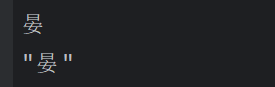

# fmt

fmt打印输出的一个方法，类似于Python中的print()

```go
import "fmt"

func main() {
    var (
    	var name string
        var age int
        var isok bool
    )
    name = "leon"
    age = 18
    isok = true
    
    fmt.Print(name) //在终端中输出想要的内容
    fmt.Printf("age: %s",age) //格式化输出，%s是一个占位符，使用age去替换占位符。
    fmt.Println(isok) //打印完指定内容之后在后面加上换行符
}
```


## 1. fmt占位符

<font color="green">一般情况下使用`%v, %s, %d, %g`会多一点，也就是要不就用%v这种通用的占位符，要不就是每种不同类型的字符串用自己的占位符。比如字符串类型就用`%s`，整数类型就用`%d`占位符。</font>

### 1.1 通用占位符

| 占位符 |                             说明                             |
| :----: | :----------------------------------------------------------: |
|   %v   | 以默认的方式打印变量的值（万能占位符，如果不知道变量是什么类型，用%v即可，go语言会自动为你识别） |
|   %T   |                        打印变量的类型                        |
|   %%   |                字面上的百分号，并非值的占位符                |

```go
package main

import "fmt"

func main () {
    s1 := "晏伟健"
    // 使用%v打印字符串
    fmt.Printf("s1: %v\n",s1)
    
    // 使用%T打印变量的类型
    fmt.Printf("s1: %T\n",s1)
}
```

输出结果：


### 1.2 整型

| 占位符 |                   说明                    |
| :----: | :---------------------------------------: |
|   %d   |   <font color="red">打印数字整型</font>   |
|   %q   |                打印单引号                 |
|   %o   |    <font color="red">打印八进制</font>    |
|  %#o   |             打印带零的八进制              |
|   %x   |            打印小写的十六进制x            |
|   %X   |            打印大写的十六进制             |
|  %#x   |            打印带0x的十六进制             |
|   %U   |              打印Unicode字符              |
|  %#U   |            打印带字符的Unicode            |
| **%b** | <font color="red">打印整型的二进制</font> |

选择最常用的几个方法：

```go
package main

import "fmt"

func main() {
	n := 100
	// 打印结果
	fmt.Printf("%b\n", n)
	fmt.Printf("%d\n", n)
	fmt.Printf("%o\n", n)
}

```

输出结果：


### 1.3 浮点型

| 占位符 |                    说明                     |
| :----: | :-----------------------------------------: |
|   %f   | <font color="blue">(=%.6f) 6位小数点</font> |
|   %e   |       (=%.6e) 6位小数点（科学计数法）       |
|   %g   | <font color="red">用最少的数字来表示</font> |
|  %.3g  |              最多3位数字来表示              |
|  %.3f  |              最多3位小数来表示              |

```go
package main

import "fmt"

func main() {
	n := 1.2
	// 打印结果
	fmt.Printf("%f\n", n)
	fmt.Printf("%g\n", n)
}

```

输出结果：


### 1.4 字符串

| 占位符 |                         说明                         |
| :----: | :--------------------------------------------------: |
|   %s   |       <font color="red">正常输出字符串</font>        |
|   %q   |        字符串带双引号，字符串中的引号带转义符        |
|  %#q   | 字符串带反引号，如果字符串内有反引号，就用双引号代替 |
|   %x   |            将字符串转换为小写的16进制格式            |
|   %X   |            将字符串转换为大写的16进制格式            |
|  % x   |                  带空格的16进制格式                  |

```go
package main

import "fmt"

func main() {
	s1 := "晏"
	fmt.Printf("%s\n", s1)
	fmt.Printf("%q\n", s1)
}

```

输出结果：


